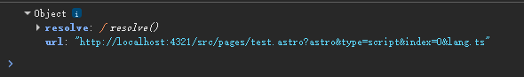
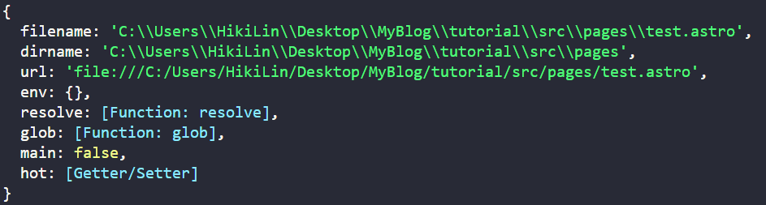
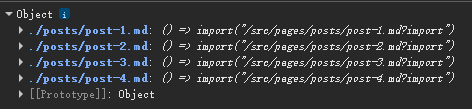
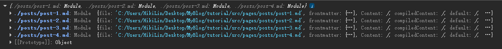
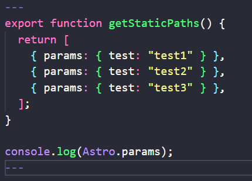

# 搭建过程中学到的新东西
### 动态变量
`{var}`
```astro
    ---
    const pageTitle = "关于我" // js/ts变量
    ---
    <h1>{pageTitle}</h1>
```

### JavaScript数组的map方法
`arr.map(f)` 基本等同于 Python 的列表推导式 `[f(x) for x in arr]`
“不改变原数组，对每个元素执行指定操作，并组成一个新数组返回”

### 条件渲染元素
```astro
    ---
    const happy = true;
    ---
    {happy && <p>我很乐意学习Astro!</p>}
    {happy === true ? <p>我很高兴！</p> : <p>我不高兴! </p>}
```

### 将(frontmatter)变量传递给`<style>`和`<script>`
`define:vars={{ 变量 }}`

### Astro组件
在`src`目录下创建`components`文件夹，其中的`.astro`文件就是一个组件
可以在其他`.astro`文件中通过：`import 组件名 from '路径' `来引入该组件，然后通过`<组件名 />`来使用该组件

### `Astro.props`和解析赋值
Astro.props是Astro内置的全局对象，用来存放父组件(页面)传递过来的值
```astro
    const {platform, username} = AStro.props;  //comp1.astro文件
```

```astro
    ---
    import Comp1 from '../components/comp1.astro'
    ---

    <Comp1 platform="X" username="HikiLin" />  //父组件文件
```

### css js和组件的引入方式
- css样式: `import '样式表路径'`
- js脚本: `<script> import '脚本路径' </script>`
- 组件: `import 组件名 from '组件路径'` 然后 `<组件名 />`来使用
- 布局：`import 布局名 from '布局路径'` 然后 `<布局名><布局名 />`来使用

### `<slot />`插槽
它是组件的一个"占位符"
比如我有一个组件BaseLayout
我在index.astro页面中使用该组件：
```astro
    <BaseLayout>
        <h2> 我会填充(覆盖)掉组件中的slot元素！ <h2 />
    <BaseLayout />
```
那么写在组件标签名之间的内容，会自动覆盖掉`<slot />`这个"占位符"

### 在Mardown文件中引入布局
在布局文件中：`const {frontmatter} = Astro.props;`。
在markdown文件中的frontmatter添加`layout: 布局路径`

### 批量导入(Glob Import)
`import.meta` 是一个由 JavaScript 引擎提供的对象，它包含当前模块（当前文件）的元数据信息。
```astro
  ---
  console.log(import.meta); //服务器端，vite引擎下
  ---

  <script>
      console.log(import.meta); //浏览器端，原生JavaScript
  </script>
```

- 在标准JavaScript中：


  浏览器原生提供的模块元数据，包含 url（当前位置）和 resolve（路径解析工具）

- 在Vite引擎下(Astro底层):


  这里就能看到`glob()`方法了

也就是说`import.meta.glob()`是Vite引擎的特性！

在控制台打印`import.meta.glob('./posts/*.md')`得到：
<br />
`glob`返回的对象，其Key是匹配到的文件的url，Value是一个函数用来生成导入语句

再把`glob`的`eager`参数设置为`true`<br />
i.e. `import.meta.glob('./posts/*.md', { eager: true })`得到：

Value直接就是'元数据模块'！

### `{allPosts.map((post: any) => <li><a href={post.url}> {post.frontmatter.title} </a></li>)}`详解
- `allPosts.map(一个函数)`
  迭代allPosts数组中的每个元素，并将其作为参数传递给函数

### 动态路由页面
我在`src/pages/[test].astro`文件中写入以下代码：


`getStaticPaths()`函数返回的数组用来告诉Astro所有可能的路径是什么
以上述代码为例，所有可能的路径如下：
- `/test1`
- `/test2`
- `/test3`
  
Astro 会预生成上面三个页面

因此当用户在浏览器访问`/test1`，Astro会在服务器端将静态预生成好的`test1.astro`页面，此时`console.log(Astro.params);`会输出：`{ test: 'test1' }`

### JavaScript的对象
一个对象就是一系列属性的集合<br />
属性包含一个'名'和一个'值'<br />
当一个属性的值是一个函数时，也称那个属性为方法<br />

`{ params: { tag: "learning in public" }, props: {posts: allPosts} }`就是一个对象，
它有2个属性：
- params: 它的值又是一个对象
  - tag
- props: 它的值也是一个对象
  - posts

### 数组的数组.flat()
```JavaScript
[[1,2,3],[1,4,5],[1,6,7]].flat() === [1,2,3,1,4,5,1,6,7];
```
顾名思义嘛~ flat！直接拍平了！

### 集合
Set 是 JavaScript 中的一种“集合”数据结构，它的核心特点是：所有的值都是唯一的（自动去重）。
```JavaScript
new Set([1,2,3,1,4,5,1,6,7]) === {1,2,3,4,5,6,7};
```

### 展开运算符
`...` 叫作“展开运算符（Spread）”，它的作用是把 Set 这个大容器里的所有“小元素”一个一个掏出来
```JavaScript
[...Set] === [1,2,3,4,5,6,7];
```