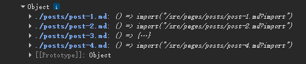
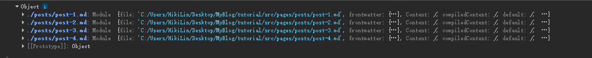

# 搭建过程中学到的新东西
### 动态变量
`{var}`
```astro
    ---
    const pageTitle = "关于我" // js/ts变量
    ---
    <h1>{pageTitle}</h1>
```

### JavaScript数组的map方法
`arr.map(f)` 基本等同于 Python 的列表推导式 `[f(x) for x in arr]`
“不改变原数组，对每个元素执行指定操作，并组成一个新数组返回”

### 条件渲染元素
```astro
    ---
    const happy = true;
    ---
    {happy && <p>我很乐意学习Astro!</p>}
    {happy === true ? <p>我很高兴！</p> : <p>我不高兴! </p>}
```

### 将(frontmatter)变量传递给`<style>`和`<script>`
`define:vars={{ 变量 }}`

### Astro组件
在`src`目录下创建`components`文件夹，其中的`.astro`文件就是一个组件
可以在其他`.astro`文件中通过：`import 组件名 from '路径' `来引入该组件，然后通过`<组件名 />`来使用该组件

### `Astro.props`和解析赋值
Astro.props是Astro内置的全局对象，用来存放父组件(页面)传递过来的值
```astro
    const {platform, username} = AStro.props;  //comp1.astro文件
```

```astro
    ---
    import Comp1 from '../components/comp1.astro'
    ---

    <Comp1 platform="X" username="HikiLin" />  //父组件文件
```

### css js和组件的引入方式
- css样式: `import '样式表路径'`
- js脚本: `<script> import '脚本路径' </script>`
- 组件: `import 组件名 from '组件路径'` 然后 `<组件名 />`来使用
- 布局：`import 布局名 from '布局路径'` 然后 `<布局名><布局名 />`来使用

### `<slot />`插槽
它是组件的一个"占位符"
比如我有一个组件BaseLayout
我在index.astro页面中使用该组件：
```astro
    <BaseLayout>
        <h2> 我会填充(覆盖)掉组件中的slot元素！ <h2 />
    <BaseLayout />
```
那么写在组件标签名之间的内容，会自动覆盖掉`<slot />`这个"占位符"

### 在Mardown文件中引入布局
在布局文件中：`const {frontmatter} = Astro.props;`。
在markdown文件中的frontmatter添加`layout: 布局路径`

### `Object.values(import.meta.glob('./posts/*.md', { eager: true }))`详解
- `import.meta.glob('./posts/*.md')` :
  ```JavaScript
    console.log(import.meta.glob('./posts/*.md'));
  ```
  

  这个函数返回一个对象<br />
  对象的'Key'是：当前文件所在文件夹的所有`'./posts/*.md'`文件的路径
  对象的'Value'是：一个异步函数

- `import.meta.glob('./posts/*.md', { eager: true })`
  把eager设为true后，Value会直接返回每个页面的模块对象
  

- `Object.values()`
  这个方法会把参数中的对象的values提取出来放到一个数组中

### `{allPosts.map((post: any) => <li><a href={post.url}> {post.frontmatter.title} </a></li>)}`详解
- `allPosts.map(一个函数)`
  迭代allPosts数组中的每个元素，并将其作为参数传递给函数

### `Astro.params`详解
- 我的文件路径(路由): src/pages/tags/[tag].astro
- 用户访问的URL: src/pages/tags/Hello
  
则`Astro.params = {tag: "Hello"}`

#### `Astro.params` vs `Astro.props`
- `Astro.params`获取的是用户访问的URL
- `Astro.props`获取的是父组件的属性